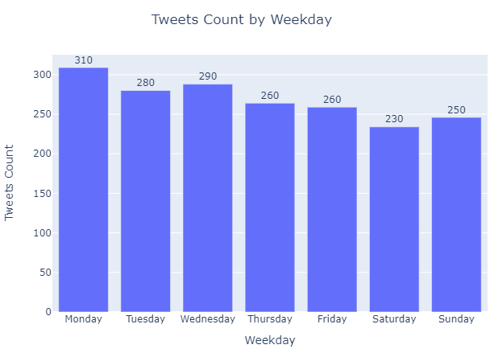
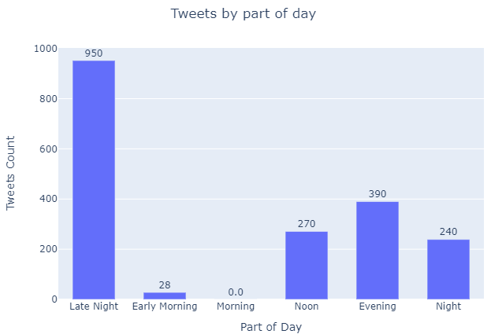
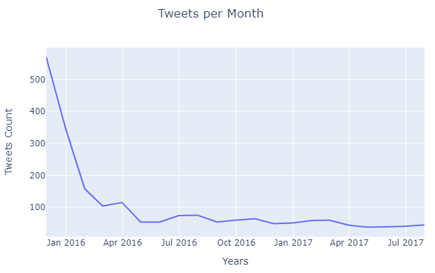
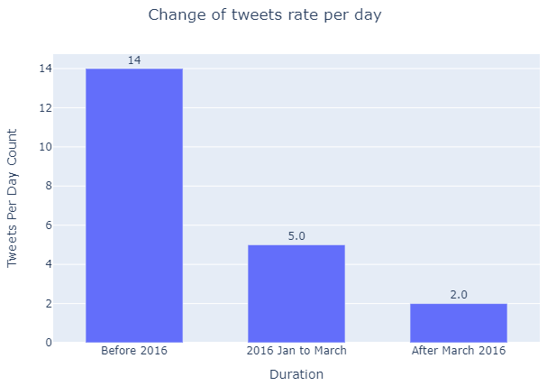
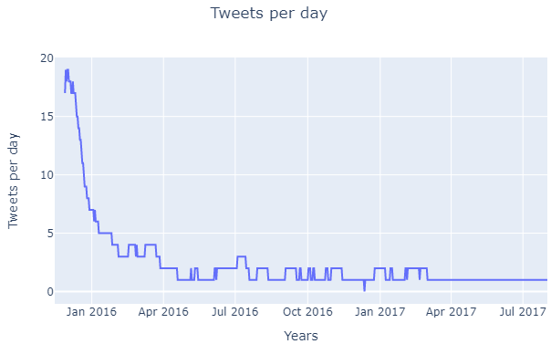
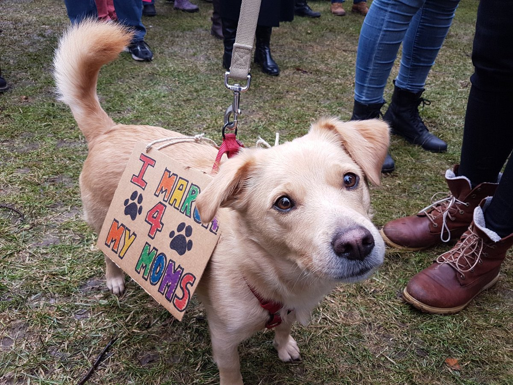
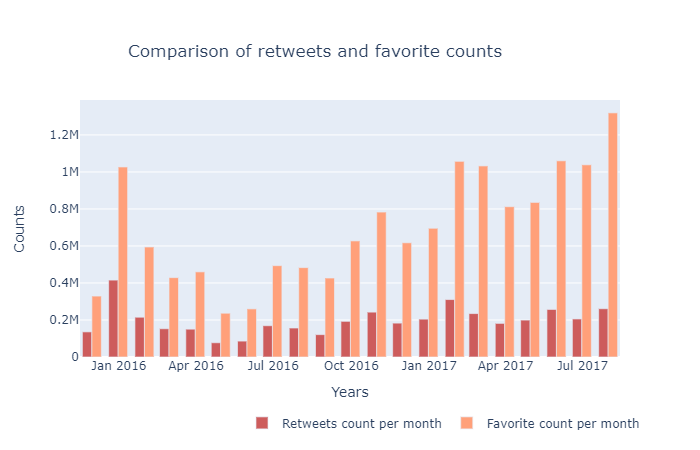
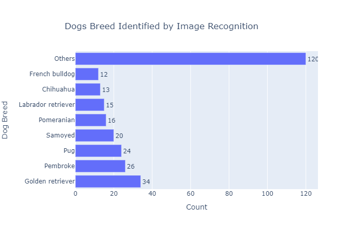

# Insights 

NOTE: The insights are with respect to tweets of WeRateDogs that contains images of dogs and not all the tweets.

## Tweets per Weekday




WeRateDogs has posted the most tweets on Sunday and least tweets on Saturday.


## Tweets by part of day

The part of days are divided into following:

```
Late night:     12 am to 4 am

Early Morning:  4 am to 8 am

Morning:        8 am to 12 pm

Noon:           12 pm to 4 pm

Evening:        4 pm to 8 pm

Night:          8 pm to 12 am
```





1. WeRateDogs posts most of the tweets during Late Night.
2. They are no posts during Morning and very few posts during early morning.

We can see that WeRateDogs is highly active at late night and very less active during mornings.


## Tweets per month



1. Until March 2016, WeRateDogs posted more than 100 tweets per month.
2. The highest tweets count in the month was recorded in the starting phase of the page.
3. Although the tweets started from 15th of November, in 15 days WeRateDogs posted a total of 292 tweets. 
4. In the next month WeRateDogs posted the highest number of 348 tweets.
5. For almost one year, i.e. from April 2015 to February 2016, WeRateDogs tweeted 50-60 times per month.
6. From March 2016, WeRateDogs has tweeted less than 50 time per month.


## Tweets rate per day




1. During the intial days, WeRateDogs showed full energy by posting 14 tweets on an average for 1st 2 months.
2. Its tweets rates reduced to 4 tweets on average per day from January 2016 to March 2016.
3. After March 2016, they have been posting 1 to 2 tweets per day which we can notice from the below chart.




## Retweets and Favorites

1. Tweet with ID 822872901745569793 and posted on 2017-01-21 18:26:02 was the most retweeted and most liked by users with retweets of 43918 and favorites of 133284. 
   
2. The top 10 retweets count contributed to 7.29% of retweets WeRateDogs ever received
3. The top 10 favorites count contributed to 6.25% of favorites WeRateDogs ever received
4. The month with received highest favorites for WeRateDogs was July 2017 with 1.31 million favorites. (The last month with complete days of data)
5. The month with received highest retweets for WeRateDogs was December 2015 with 0.4 million retweets. (The first month with complete days of data)



## Dog Stages

A total of 214 pupper, 61 doggo, 26 puppo and 7 floofer were identified.

## Dogs breed identified by Image Recognition




1. Golden Retriever were the most identified by the model.
2. Total of 280 dog breeds were successfully identified.